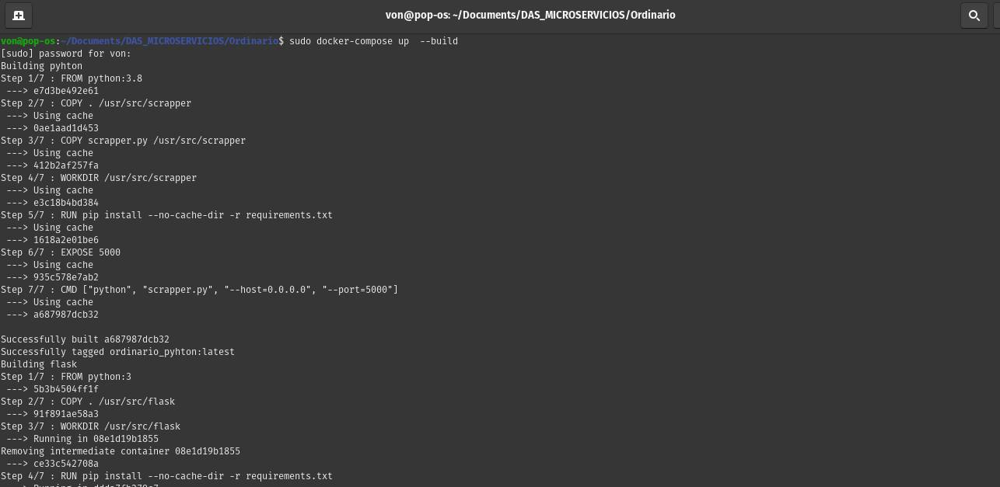
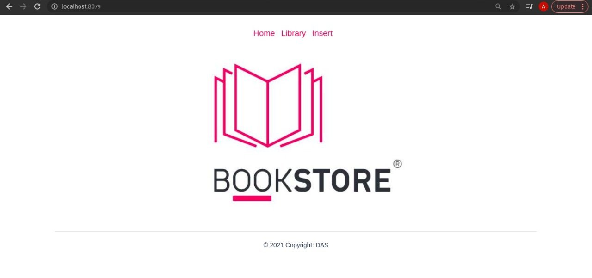

# [DAS_MICROSERVICIOS](https://github.com/alicia-granados/DAS_MICROSERVICIOS)
Repository for the final project of the subject Software Design and Architecture implementing the Microservices Architecture.

## Subject.
Diseño y Arquitectura de Software.

## Professor.
Angel Santiago Jaime Zavala.

## Team.
- Alicia Montserrat Monjaras Granados
- Jorge de Jesús Hernández Vázquez
- Bryan Peña Balderas

## Prerequisites.
- Docker
- DockerCompose

## Diagram Architecture.

## Tecnologíes.
This are the main technologies that we use to develop this project:
- Mongo (Database)
- MongoExpress (DBMS)
- Vue.js (Frontend)
- Flask (Backend)
- Rabbit (Broker)

To orchestrate containers we use:
- Docker
- DockerCompose

### Architecture.
The established architecture was "microservices" with a total of 6 services distributed in different containers.
- ***Container A***: Contains a functional image of **MongoDB**.  
His name is *"mongo_db"*
- ***Container B***: Contains a functional image of **MongoExpress**.  
His name is *"dbms"*
- ***Container C***: Contains an scrapper made in **Python**, that extracts data from 
[Vocadb](https://developers.google.com/books), and inserts it into the database.  
His name is *"scraperLibros"*
- ***Container D***: Contains an image of **Flask**, which will be used as an API to establish communication and handling of requests.
His name is  *"pyapp"*
- ***Container E***: Contains a functional image of **RabbitMQ**.
His name is  *"rabbit"*
- ***Container F***: Contains a functional image of **Vue.js**, which shows the graphical interface of a website, where you can make different requests to the api.
His name is  *"vue"*

## Instructions for running the containers.
1. Clone the repository.
2. Enter the repository folder.
3. In case of having containers running, make sure that all containers are stopped.
<code>$ sudo docker stop $(sudo docker ps -q -a)</code>
4.- Make sure all the ports needed to run the containers are available.
5.- As an optional step you can delete all the images and containers so that they do not cause any  type of conflict .
<code>$ docker system prune --all</code>
6.- Run the orchestrator.
<code>$ sudo docker-compose up --build</code>
> Help: Once it is running we can see what is happening on the console.

## Instrucciones para acceder a los servicios
1.- El servicio de MongoDB corre en el puerto *27017*.
2.- El servicio web de MongoExpress corre en http://localhost:8082.
<code>usuario: foo</code>  
<code>contraseña: bar123</code>
3.- El servicio Python (API) corre en http://localhost:5000.
3.- El servicio Flask corre en http://localhost:5001.
4.- El servicio de RabbitMQ corre en el puerto *15672* además también corre en http://localhost:15672.
5.- El servicio de Vue.js corre en http://localhost:8079

## Recorrido por Mongo Express
Este servicio permite el almacenamiento, modificación y extracción de la información en una base de datos.Primero es necesario ingresar las credenciales para tener acceso a la base de datos.

Mostrará los libros insertados desde el Contenedor C. Ahi podrás insertar , borrar, actualizar o ver la infromación  del libro mediante el dbms de Mongo.

## Recorrido por la página web de Vue.js
Este servicio se basa en consumir la API del contenedor de Flask mediante los métodos HTTP.

Al dar click en el enlace de  Library,  encontras una tabla con todos los libros que se encuentren en la base de datos.

También podrás registrar tus propios libros, por defecto el formulario ya cuenta con información
base para que la demostración sea más rápida.

Para comprobar que tu libro se ha registrado con éxito sólo debes volver a la categoría Librería y ver 
el último libro que se ha insertado.

Además contamos con las opciones de borrar, ver y actualizar.

Para borrar solo es necesario dar click en el botón delete. Después de hacer el paso anterior se mostrará la alerta con el mensaje de que se elimino el libro.
  

Para ver la información de solo un libro es necesario dar click en el botón de View.

Para actualizar la información de un libro es necesario dar click en Update. Después de hacer el paso anterior se mostrará un formulario con la información del libro, y si es necesario actualizar solo ingresa dicha información en el campo que le corresponda y luego dirigete a dar click en el botón de update, luego se mostrará la alerta con el mensaje de que se actualizó el libro.

## Extras
In the folder <code>vue</code> you will find another README with technical details of Vue.js.

## Project Video
[DAS_MICROSERVICIOS](https://drive.google.com/file/d/1uMHLMG_LsaQVn6itzyvkREYkrWXNFvk0/view?usp=sharing)